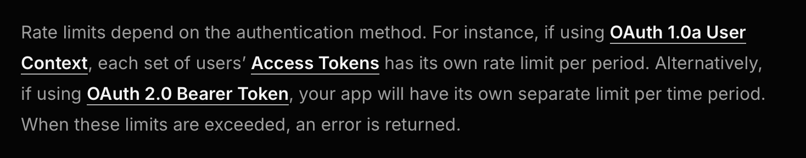
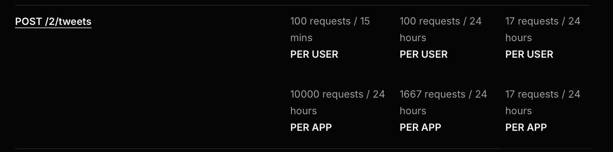

# X CLI - Stay in flow while building in public

```bash
# Installation
$ npm i -g xymake@latest
$ xy setup

# Creates X Post/thread linked to the repo in cwd
$ xy hello, world!

# Post without connecting to a github repo
$ xy -n hello, world!

# Open your current thread in browser when needed
$ xy open
```

Share your work on X directly from your terminal. No more context switching, no more distractions—just seamless integration between your code and your audience. [Demo here](https://x.com/janwilmake/status/1905542045332050431)

XYMake CLI uses `git remote get-url origin` to check which repo you are talking about to create coherent threads based on your repository.

> [!IMPORTANT]
> X CLI is currently in public beta. We are sharing an app based [ratelimit of 17 posts per day](https://x.com/janwilmake/status/1905561310437273731), so it's likely you'll quickly/immediately hit the rate limit. After there's sufficient demand, I'll purchase the $200/m plan and the cap will become 20 tweets per day per user, with $0.10 per tweet for additional tweets.
>
> What you can do?
>
> - [Spread the word (quote this demo)](https://x.com/janwilmake/status/1905542045332050431)
> - Contribute to the repo
> - [Consider donating](https://github.com/sponsors/janwilmake)

## Why XYMake CLI?

The average developer loses hours to social media distractions daily. XYMake CLI gives you the power to engage with your audience without falling into the attention trap.

**🧠 Stay in flow state** - Post directly from your terminal without breaking your concentration

**⏱️ Save hours daily** - No more getting lost in feeds and notifications

**🚀 Build in public effectively** - Share your progress naturally as part of your workflow

XYMake CLI connects to your X account securely through OAuth. Your first post is just one command away.

## Coming soon:

- `xy history [n]` - Get latest threads and read them as markdown with comments
- `xy ship` - Commit to git and post to X simultaneously
- `xy snap` - Create and share screenshots
- `xy ./path.png` - Upload photos/videos with comments
- `xy ./path.ts:10-20` - Annotate specific code sections
- `xy yap` - Record, transcribe, and send audio
- `xy find` - Find relevant tweets from CLI and respond easily
- `xy prompt` - AI-powered tweet suggestions based on your code changes

---

Built by developers, for developers. [Jan Wilmake](https://x.com/janwilmake)

## Origin story - February + March 2025

I came up with the idea of making a CLI for posting on X on February 10 after seeing someone posting one on X and seeing it was very hard to use (having to make a client/token etc), but didn't spend much time trying it. I didn't think much of the time. But as time went on, the idea of doing more with the X platform developed further. Among other things, I built https://threads.forgithub.com and around that time I also met @brianships who made https://socialdata.tools. One of the things we talked about is the following (Source: https://xymake.com/janwilmake/status/1903776061239767211)

> @janwilmake - 3/23/2025, 11:49:18 AM: The hardest skill I am trying to master right now is knowing when to turn X on and when to turn X off again. If only there were a tool that could tell me this based on certain metrics on activity of my X account 🤔 cc @brianships
> (1 likes)

> @janwilmake - 3/23/2025, 11:51:04 AM: @brianships In the past months, X has proven very valuable for my work.
>
> But it also consumes my energy and time, until sometimes there's nothing left I can output but tweets.
>
> I need automatic agent that gateways my X for me, so I can access it if it has high-impact for my direction of work
> (1 likes)

> @brianships - 3/23/2025, 6:55:09 PM: I think it's actually pretty easy to make an agent that will review posts for you and ping you when there is something relevant/important:
>
> 1. Create a Twitter list of accounts that post something relevant to your work
> 2. Use our search endpoint to fetch recent tweets from this list (query = "list:LIST_ID"). I would probably also filter tweets based on a min number of likes to reduce noise
> 3. Send each tweet through an LLM to assess it's relevance
> 4. Generate an overview with links to relevant tweets and send it to email/Discord/etc.
>    (1 likes)

After that, my brain started running wild. Just like I have all these ideas for github, I had so many ideas for twitter! Within a few days from this post, I built https://xymake.com into a real product built on top of https://socialdata.tools.

# Update 2025-03-27

Brian tipped me about someone building an API going from commits to tweets through an LLM. I talked with him, but wasn't convinced. My brain started racing again. Just a CLI and spend $0.05 per post. What about that? _Main insight: I don't need to gatewall X if I don't have a reason to leave my editor to get stuff done on X!_ And what if it were connected to your repo you are working on, via the cwd? Wow. This idea just became good. Looking at this now, even think it's much more relevant than when I looked last time. Also I have a better idea on how to do it now. I need to reduce 2 interfaces to 1, enabling posting while disabling feed and notifications! I just need the following to make a POC.

It's feasible since im probably already using OAuth 1.0 User Context - https://docs.x.com/resources/fundamentals/authentication/overview

If I can't use that context, I need to get basic ($200 per month) for multi-users, but probably it's fine with free (it seems up to 17 tweets per user per 24 hours, which means I can also do it without DO scheduler, just doing it instantly)

Ratelimit info:





The post tweet API itself with OAuth is also great for later for other things! So let's get started, hopefully tomorrow (it's 1:13 AM now, going to bed, feeling accomplished about this great idea).... 😴

## POC (2025-03-28)

❗️ The potential impact is huge: saving hours (!!) of distractions every day, staying in flow in the editor. 🤯

API

- ✅ X oauth on xymake.com that uses DO (done)
- 🤯 After some testing and digging, it seems that the user-based ratelimit is only available to enterprise through the 1.1 api: https://devcommunity.x.com/t/v1-1-api-no-longer-working/199890/3
- ✅ Expose endpoint to tweet. Either new tweet or comment on given id. will queue using the DO alarms to prevent hitting ratelimits. use https://docs.x.com/x-api/posts/creation-of-a-post.
- ✅ Finalised the initial API structure - reply, quote, or new! It works!

[](https://x.com/janwilmake/status/1905239936082518410)

CLI

- ✅ package `npm i -g xymake` with bin `xy`
- ✅ `xy setup` opens browser to https://cli.xymake.com and requests pasting api key and x username. Then, sets it in global config location
- ✅ `xy [-n] ...` to send a tweet using the xymake api.
  - If no config api key yet, error
  - If `-n` it won't connect to a thread, will just post the tweet
  - Finds current git remote and branch and verifies it to be github (or errors if not found)
  - Will start new thread if the latest one is over a day ago (but will quote old one). Will always attach tweets to repos by adding the repo url in a reply to the first tweet.
  - keep state of last tweet id + date per repo in `xymake.json` in repo root; `{"posts":{"url":string,"createdAt":string,"branch": string}[]}`
- ✅ `xy open` opens current thread in browser

Easy onboarding

- ✅ New page for dashboard with API key for CLI.
- ✅ Generate and show API key and scopes are shown as well
- ✅ New landingpage https://cli.xymake.com that explains the X CLI

## BACKLOG

For me:

- ✅ Added login redirect
- ✅ Add `getSubscriber` to tweet endpoint and ensure the refresh flow works as expected
- ✅ create and host xymake.json schema
- ✅ Append repo url to first post, not as comment. this seems to have better unfurling support
- ✅ Allow configuring a custom appendix to your new thread post.
- Support for referencing files. For now, if the first param after xymake matches a filepath relative from cwd, ensure to get the git root relative, and append https://github.com/owner/repo/blob/branch/...path instead of the regular appendix!
- create config for adding post to a community on a repo-basis but also a default fallback!
- Alter CLI such that I can add core threads to each repo and it'd allow me to pick one any day to start a quoted post of it. `x -s` would allow to select a thread first, or if it's been >24h, it will allow this. `xymake.json` should become an accumulation of useful threads that can also be altered easily!
- Post 17x per day in this way.

For waitlist:

- Find 10 people that want to use this daily (Current: 2/10) - change console to preselling: sponsor €50+ to get access asap
- Buy [basic plan](https://docs.x.com/x-api/introduction#basic) $200/month after enough interest is shown.

More CLI

- `xy history [n]` to get the latest thread (or multiple) and read through it as markdown (also seeing all comments)
- `xy ship ...` to send a tweet but also ship changes to git with the same tweet.
- `xy snap` to make a screenshot
- `xy ./path.png ...` to upload photo/video with comment, or turn a text file into a thread, or add a link to a file!
- Maybe can even do line number annotations and have it make screenshots of these sections. That'd be a killer feature. `xy ./path.ts:10-20 ...`
- `xy yap` to record, transcribe, send
- `xy find` to find relevant tweets from the cli and show them as numbered threads, allowing easy responding (uses `forgithub.threads`)
- Features to improve tweets further somehow, e.g. based on relevant files, auto-tagging people, etc.
- `xy prompt` to allow AI to write/suggest the tweet (in different ways, e.g. based on changes - cc https://tweetgit.com https://x.com/dzhohola)
- someone like https://x.com/yagiznizipli posts all PRs on X and that also kinda works but X wants X. branch detection is definitely required to determine the thread!

Monetisation

- For free users, add advertisement to second message of a thread.
- Charge $0.05 per tweet for paid users, pay as you go. someone like me that ships and tweets 50+ times daily, that's $75 per month.
